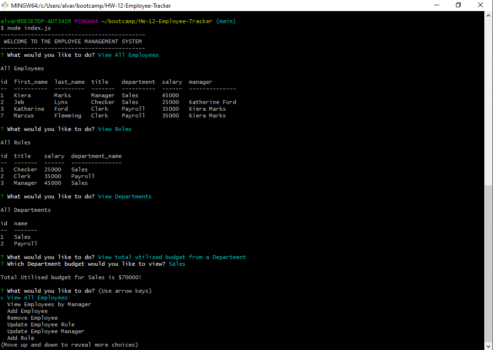

# HW-12-Employee-Tracker
 
## Description
 
This is an application to keep track of employees, their role assignment and which department they are part of. Emplpoyees cane be add, updated and removed. Roles can be add or removed, as well as departments. You may also view the total budget for a specific department.
 
## Table of Contents 
 
* [Installation](#Installation) 
* [Usage](#Usage) 
* [License](#License) 
* [Contributing](#Contributing) 
* [Tests](#Tests) 
* [Questions](#Questions)
 
## Installation 

You must have MYSQL installed on your machine locally and run the code in the seed.sql to initialize the database. An example employee list is available to preview if you wish. Or start from scratch in the application. You may alter the code in index.js to include your password  for MYSQL or create a .env file in the folder with 'MYSQLPW' equal to your password.

If running from a terminal, such as gitbash, provieded you are in the proper directory, you must first install the appropriate dependencies by first typing 'npm i' after which you can run the application by typing 'node index.js'.
 
## Usage 
 
Follow the prompts as given.

[Link to Howto Video](https://drive.google.com/file/d/1itFHUT5AYlP5CqmCrheWJTf5GRxgvqfv/view)

 
## License 
 

 
## Contributing 
 
none
 
## Tests 
 
None
 
## Questions 
 
[Github Profile](https://github.com/DrewAlvarez/) 
 
I can be contacted at this email: <alvarez.drew@gmail.com>